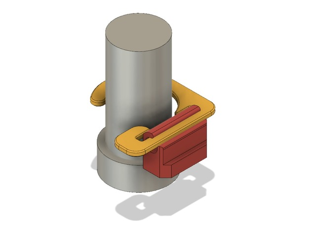

# Track Saw Rail Dog Clips

## Summary

Inspired by UJK's dog rail clips, here's a fully printable clip that works for the Triton tracks.

This is likely compatible with the Makita tracks as they too have the anti-tip lip.  Festool owners can just buy the UJK part.

The design assumes your cutting surface is above the 10mm base of the Parf Dogs as the spring clips only can reliably go around the 20mm diameter section of the posts.  

## Design

Original design on Fusion 360 - https://a360.co/2s7oDmr.  Feel free to branch/edit with the license below.

## License

licensed under the Creative Commons - Attribution - Non-Commercial - Share Alike license.
http://creativecommons.org/licenses/by-nc-sa/3.0/